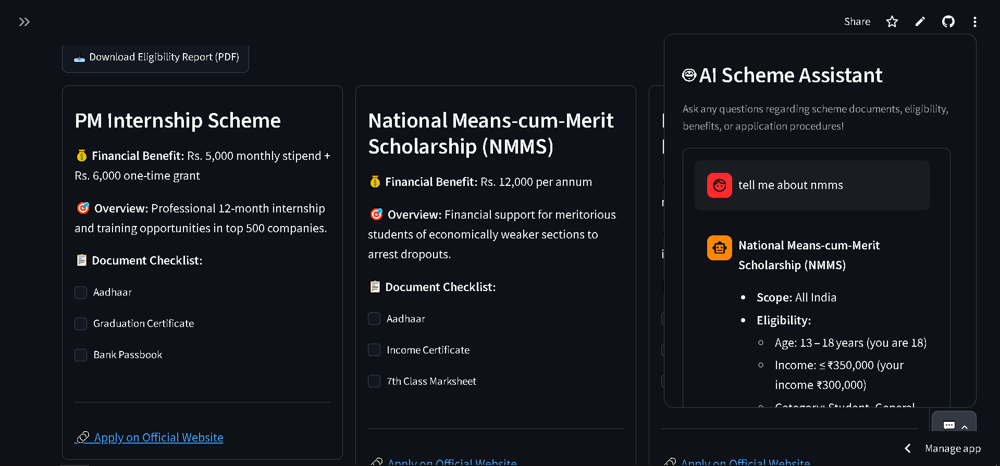

# 🧧 Government Scheme Finder

Find Indian government schemes you may qualify for, check the documents you need,
compare schemes side by side, and ask an AI assistant questions about them.
Available in **English and Hindi**.

**Live demo:** _https://government-scheme-finder.streamlit.app/_

())
<!-- Add 2-3 screenshots (form, results, chatbot) and a short demo GIF to /screenshots -->

## Why this exists
Many people never find out which welfare schemes they are eligible for, or which
documents to prepare. This app turns a few profile details into a shortlist with
benefits, a document checklist and an official application link.

## Features
- **Eligibility engine** - filters schemes by age, income, occupation, gender,
  social category and state
- **Document checklist** for every matched scheme
- **Scheme comparison** table
- **PDF report** of your matched schemes
- **AI assistant** that answers questions using only the scheme data
- **English / Hindi** interface

## How it works
1. **Rule-based eligibility** - `is_eligible()` checks each scheme's rules from
   `scheme_data.json`. A missing rule means "no restriction".
2. **Retrieval-augmented chatbot** - for each question, a keyword retriever scores
   schemes by the words they share with the question (scheme-name matches count
   more), and the top matches are sent to the LLM as context. The system prompt
   tells the model to answer only from that context and to point users to the
   official website when it does not know. There are no embeddings; keyword
   retrieval is enough for a small dataset.

## Tech stack
Python, Streamlit, Groq API (`llama-3.1-8b-instant`), fpdf2, streamlit-float.

## Run it locally
```bash
git clone <your-repo-url>
cd <your-repo>
pip install -r requirements.txt
```
Create `.streamlit/secrets.toml` (this file is git-ignored):
```toml
GROQ_API_KEY = "your-key-here"
```
Then:
```bash
streamlit run app.py
```
On Streamlit Community Cloud, paste the same line into the app's **Secrets** box.

## Data format (`scheme_data.json`)
```json
{
  "scheme_name": "Example Scheme",
  "category": "Farmer",
  "state": "All India",
  "eligibility": { "min_age": 18, "max_age": 60, "max_income": 200000 },
  "target_gender": ["Male", "Female", "Other"],
  "target_caste": ["General", "OBC", "SC", "ST"],
  "financial_benefit": "₹6,000 per year",
  "benefits": "Short description of the benefit",
  "required_documents": ["Aadhaar card", "Bank passbook"],
  "application_link": "https://official-site.example",
  "last_verified": "2026-10-01"
}
```
Only `scheme_name` is required; every other field is optional.
`category` can be `General`, `Student`, `Farmer`, `Business`, `Women` or `Senior Citizen`.

## Limitations
- Covers a limited set of schemes and states; data is entered by hand from official sources.
- Eligibility rules are simplified. **Always confirm on the official scheme website.**
- Keyword retrieval works best for English questions; Hindi questions fall back to
  your matched schemes.
- PDF reports are English only.

## Roadmap
- More schemes and states, with source links for every rule
- Embedding-based retrieval
- Hindi PDF reports

## Disclaimer
This tool is a guide, not legal or official advice. Eligibility and benefits change;
verify everything on the official government website before applying.
